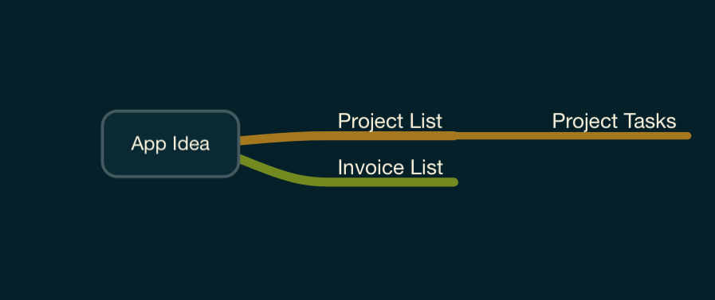
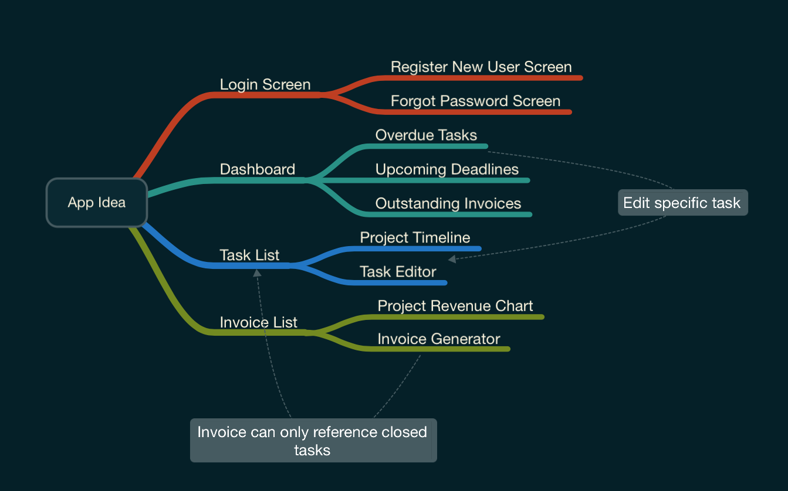
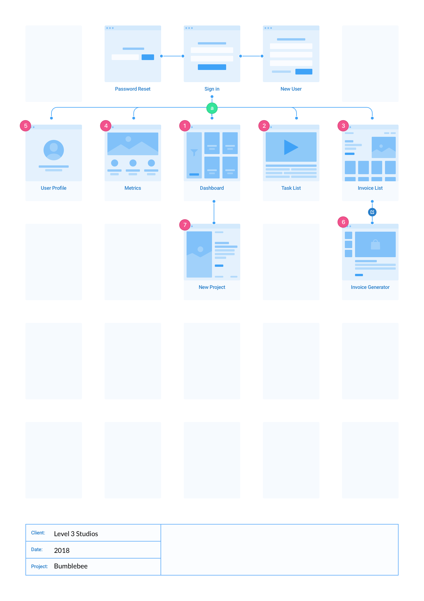
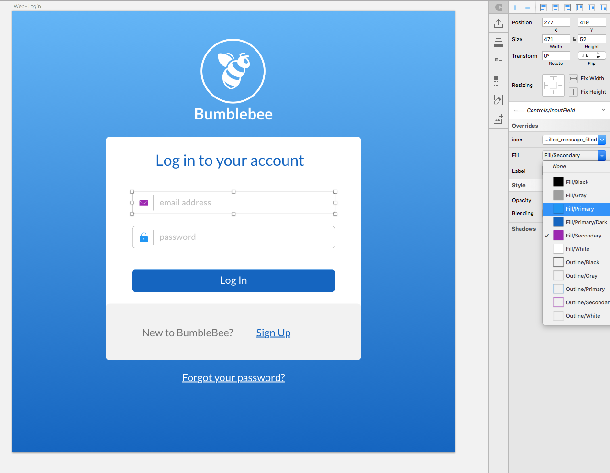

# Bumblebee

## Introduction
Bumblebee is an overly ambitious task manager and invoice generator that is open source and cross platform capable. It's meant to be a working demo of a real full stack application that goes beyond the traditional "todo" list demo that can be found for each individual platform. 
 

## Design
I've found that being a developer doesn't exclude me from being part of the design process. In fact I've found more often that when a developer is involved during the design stage then the entire project is built faster and with less revisions needed to fix those random issues that pop up when translating a design to code. Being part of the design process allows developers to define the entire system around how a user would interact with the application before a single line of code is written. 

### MindMap
**What I use:**

* [MindNode](https://mindnode.com) - Has a great interface and the iCloud sync between iOS and macOS means I can work out ideas no matter where I'm at. 

Most of the time a new project is started with a simple idea, or even statement regarding the goal of the application. Although this isn't always a necessary, or even required, step in the process if you do find yourself in the early stages of the app design then a mind map can help flush out some of the main parts of the app. This part is usually a quick process, normally just used to get the basic idea down so I can move into the flowchart part with specific layouts already in mind. 

*Initial idea node for bumblebee*

*The more finalized mind map*

### Flowchart
**What I use:**

* [Sketch](https://www.sketchapp.com) - A great application with tons of plugins that can speedup the entire design process. I also like having the ability to have all of my icons, colors, and typography in one place. 
* [Platforma Flowcharts](http://web.flowcharts.ws) - Available for web and mobile projects, these kits are great for creating clean and descriptive flowcharts

I like to think of the Flowchart as a more detailed mind map, but a not so detailed UI Kit. As the name implies, the flowchart is geared towards working out the flow of the application based on how the user, or other parts of the app, can interact with each screen. 

*due to licensing I can't actually share the elements that make up the flowchart, so I included a screenshot of the flowchart in the Sketch file*

*Initial flowchart design*

### UI Kit
**What I use:**

* [Sketch Swatches](https://github.com/Ashung/Sketch_Swatches) - Nice little plugin for Sketch with various color palettes. I tend to use the Material palette when working on cross platform projects
* [Icons8](https://icons8.com) - Massive icon library with just about any format you would want. 
* [Craft Plugin](https://www.invisionapp.com/craft) - The craft plugin from InVision offers some really nice tools, the one I like the best is there Data tool which can fill in labels with actual text instead of the normal *Lorum Ipsum* text. 

Now this is where the power of Sketch really comes in handy and makes designing an application so much fun. With the override ability you can create symbols that work as placeholders and then with a few clicks change icons, colors, and typography much like a developer would do when creating UI elements. 

*Overrides let you create reusable UI elements quickly*