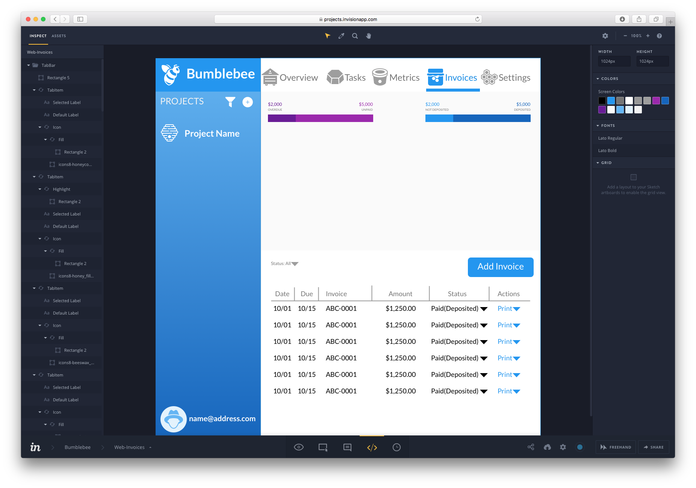
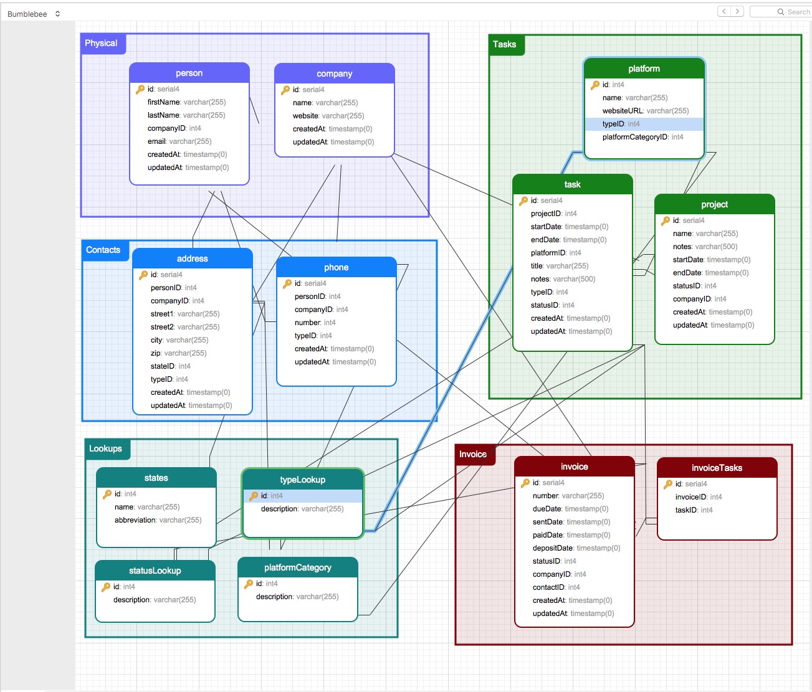
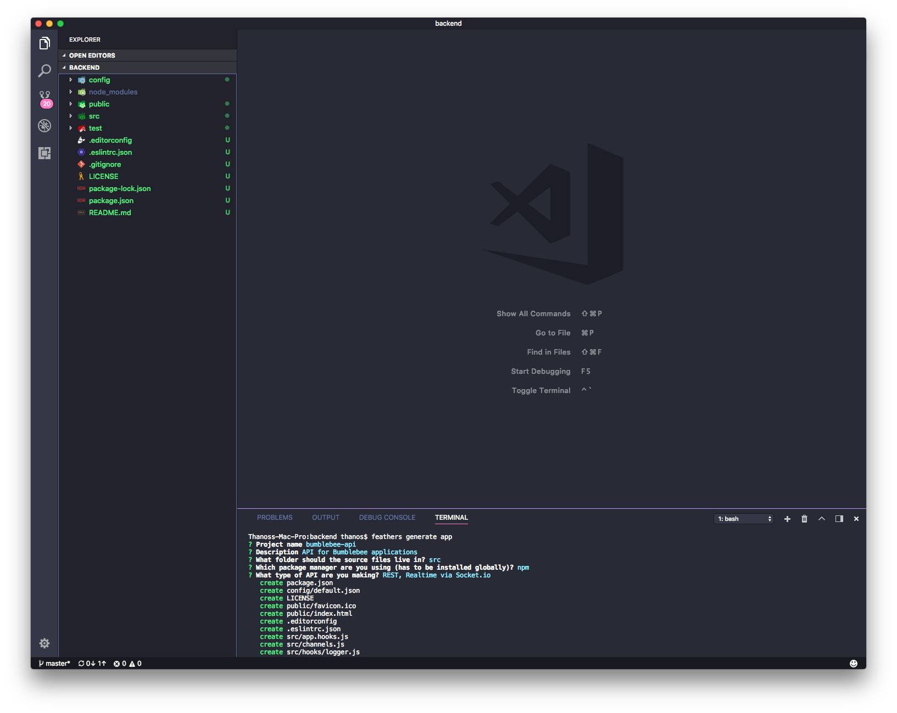

# Bumblebee

## Introduction
Bumblebee is an overly ambitious task manager and invoice generator that is open source and cross platform capable. It's meant to be a working demo of a real full stack application that goes beyond the traditional "todo" list demo that can be found for each individual platform. 
 

## Design
I've found that being a developer doesn't exclude me from being part of the design process. In fact I've found more often that when a developer is involved during the design stage then the entire project is built faster and with less revisions needed to fix those random issues that pop up when translating a design to code. Being part of the design process allows developers to define the entire system around how a user would interact with the application before a single line of code is written. 


### MindMap
**What I use:**

* [MindNode](https://mindnode.com) - Has a great interface and the iCloud sync between iOS and macOS means I can work out ideas no matter where I'm at. 

Most of the time a new project is started with a simple idea, or even statement regarding the goal of the application. Although this isn't always a necessary, or even required, step in the process if you do find yourself in the early stages of the app design then a mind map can help flush out some of the main parts of the app. This part is usually a quick process, normally just used to get the basic idea down so I can move into the flowchart part with specific layouts already in mind. 


*Initial idea node for bumblebee*


*The more finalized mind map*

### Flowchart
**What I use:**

* [Sketch](https://www.sketchapp.com) - A great application with tons of plugins that can speedup the entire design process. I also like having the ability to have all of my icons, colors, and typography in one place. 
* [Platforma Flowcharts](http://web.flowcharts.ws) - Available for web and mobile projects, these kits are great for creating clean and descriptive flowcharts

I like to think of the Flowchart as a more detailed mind map, but a not so detailed UI Kit. As the name implies, the flowchart is geared towards working out the flow of the application based on how the user, or other parts of the app, can interact with each screen. 

*due to licensing I can't actually share the elements that make up the flowchart, so I included a screenshot of the flowchart in the Sketch file*


*Initial flowchart design*

### UI Kit
**What I use:**

* [Sketch Swatches](https://github.com/Ashung/Sketch_Swatches) - Nice little plugin for Sketch with various color palettes. I tend to use the Material palette when working on cross platform projects
* [Icons8](https://icons8.com) - Massive icon library with just about any format you would want. 
* [Craft Plugin](https://www.invisionapp.com/craft) - The craft plugin from InVision offers some really nice tools, the one I like the best is there Data tool which can fill in labels with actual text instead of the normal *Lorum Ipsum* text. 

Now this is where the power of Sketch really comes in handy and makes designing an application so much fun. With the override ability you can create symbols that work as placeholders and then with a few clicks change icons, colors, and typography much like a developer would do when creating UI elements. 


*Overrides let you create reusable UI elements quickly*

### Prototype
**What I use:**

* [InVision](https://www.invisionapp.com/) - Probably one of the easier prototyping tools I've used, and with the Craft plugin syncing from Sketch to InVision is done with just one click. 

Now this usually isn't a required step to take during the process, but if you have the chance to do so or just want to go that extra mile then try turning the UI Kit into a prototype. There are a lot of other tools available for this ([Marvel](https://marvelapp.com), [Figma](https://www.figma.com) and [UXPin](https://www.uxpin.com/prototyping) to name a few) so really it boils down to personal preference. For InVision, just setup a project and then jump back to Sketch, tap on the Craft Sync button and that's it. Once uploaded you can add hotspots for the interactive elements (buttons, hyperlinks, etc) and then share a link with clients/colleagues who can add their comments as well. 


*InVision's inspector area let's you pull colors and fonts for whatever platform you are developing on*

### Da base Diagram
**What I use:**

* [Navicat](https://www.navicat.com/en/products/navicat-premium) - The Premium version comes with a built in Data Modeler, but it's also pretty pricey when it comes to database tools. I've tried quite a few, keep coming back to Navicat so now I'm finding the best ways to use it. 

Most of my experience in databases has been in the SQL world, so whenever I'm working on a project that doesn't have a choice yet I'll usually offer up PostgreSQL. I don't claim to know all the differences between MySQL, SQL Server, SQLite and PostgreSQL, but so far I've had nothing but good experiences with PostgreSQL on larger projects and MySQL for smaller projects. Even though this is a small project we will be going with PostgreSQL since it's open source and available on just about every hosting platform when ready for production. One of my favorite features in Navicat is the ability for the modeler to export the diagram as a SQL statement that can then be used to create the tables when ready. 


*Modeling in Navicat is really easy*

## Development
With the design stage finished it's time to start getting some code done. As a native developer I prefer to use native languages for each platform instead of going the Xamarin or React route. Nothing against those platforms, or those who choose to use them, I just prefer to use native tools since it gives me more flexibility when working with clients that have existing products/teams. 

### Database Setup
**What I use:**

* [Postgres.app](https://postgresapp.com) - A quick and easy way to get a PostgreSQL server setup locally.

With the Database Diagram complete I usually segue right into setting up the database tables and fill in some of the tables with necessary data. There's not much that needs to be done for this step other than to get the Postgres app installed and running and then plug in the database information into Navicat and then I'm ready to start importing the tables from the diagram sql export. 

### RESTful API 
**What I use:**

* [Visual Studio Code](https://code.visualstudio.com) - Super lightweight editor that can handle just about any programming language out there. I also really like the built in editor when working with JavaScript apps. 
* [FeathersJS](https://feathersjs.com) - A newer framework based on Express that I recently started using. Needed to pick one for this guide and FeathersJS was the easiest one for me to get setup and running with minimal knowledge of JavaScript. 
* [Postman](https://www.getpostman.com/postman) - An excellent tool for testing API's 

There are a ton of frameworks for setting up a backend service that I'm not even going to bother trying to name them. Coming into this project I've worked with different frameworks that were already setup by another developer, but never had the chance to start one from scratch. As I tried out different frameworks and read article after article I realized why JavaScript developers are in high demand with many startups. I settled on FeathersJS only because I felt it provided me with just enough boiler code and modules that getting up and running only took few commands and that was it. To get started with a project all you need are these two lines:
 
```terminal
npm install -g @feathersjs/cli
feathers generate app
```


*The built in terminal keeps me from having to leave VSCode*